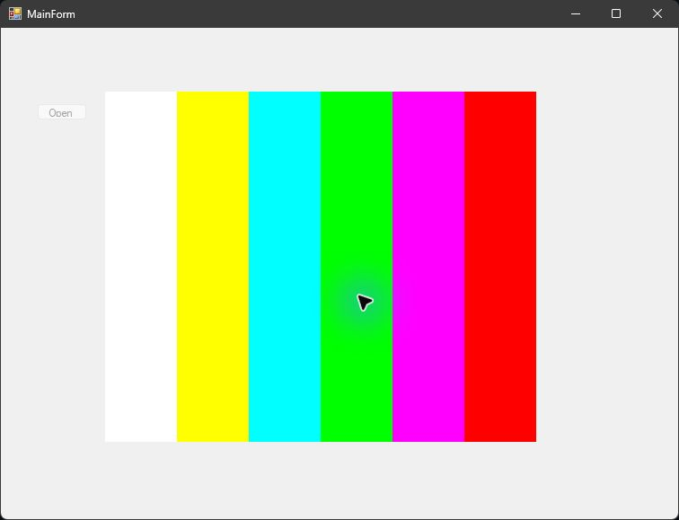

# C++/CLI Image Viewer

A small Windows Forms exercise written in C++/CLI. The current implementation lets a user choose one image file and display it in a PictureBox. Despite the former "Image Enhancer" label, the source does not implement image-enhancement filters or image processing.

[Source](https://github.com/haribo841/cpp-cli-image-viewer) | [Usage guide](docs/USAGE.md) | [MIT license](LICENSE) | [Report an issue](https://github.com/haribo841/cpp-cli-image-viewer/issues)

## Preview

Actual application capture, using the included synthetic 640 x 480 [test image](docs/images/sample-color-bars.png). No personal photographs or third-party artwork are needed.

## Features

- Windows file-picker workflow.
- Loads the selected image through System.Drawing.
- Displays the image in a Windows Forms PictureBox.
- Prevents another selection after an image is loaded in the current window.

## Quick start

Requirements: Windows, Visual Studio 2022 with Desktop Development with C++, C++/CLI support, the MSVC v143 toolset, and .NET Framework 4.8 targeting support.

1. Open Project1.sln in Visual Studio.
2. Select a Debug or Release configuration and either x86 (Win32) or x64.
3. Build and run the project.
4. Use the Open Image button and select a local image.

For a repeatable first run, choose `docs/images/sample-color-bars.png`. The image appears in the PictureBox and the Open Image button becomes disabled. Restart the app to choose another file.

There is no prebuilt release. Build from source; the solution and executable retain the internal name `Project1`.

See [the usage guide](docs/USAGE.md) for the current interaction and limitations.

## Supported platform

Windows desktop only. The project targets .NET Framework 4.8 and uses C++/CLI Windows Forms, so it is not a cross-platform application.

## Documentation, license, and support

- [Usage guide](docs/USAGE.md)
- [Previous README archive](docs/archive/README-2026-09-16.md)
- [MIT license](LICENSE). External frameworks retain their own licenses.
- Report an issue with the Visual Studio version, selected configuration, and reproduction steps.
